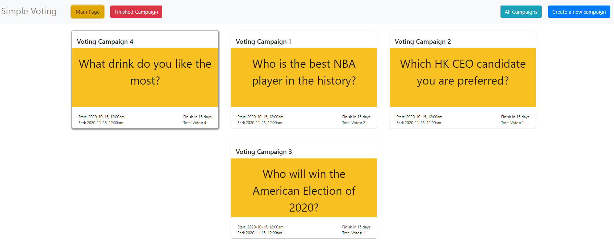

# Simple Voting

## App Introduction
This is a simple voting system.  Anyone can setup voting campaigns for users' voting.

Pages:
1. Main Page
   for whom wants to find an interesting campaign for voting
2. Finished Campaign Page
   for whom wants to find the historial campaigns
3. Create a new Campaign Page
   anyone can create a new campaign for anyone to vote
4. All Campaigns Page
   for whom wants to know the top total votes among existing campaigns and mixed with expired campaigns ordered by ending time 

## Setup

BACKEND
```
cd simpleVoting/server
yarn install
cp .env.sample .env
nano/vim .env and input your DB_USERNAME & DB_PASSWORD
start your SQL and run -> CREATE DATABASE simple_voting;
exit your SQL command line and back to simpleVoting/server;
yarn knex migrate:latest
yarn knex seed:run
ts-node main.ts or node index.js
```

FRONTEND (react)
```
open a new bash terminal
cd simpleVoting/my-app
yarn install
cp .env.sample .env
yarn start
```
if there is any error, feel free to contact me. My email is kaming1009@gmail.com

Remark: 
The PIN will be generated after voted but it is no use for current stage.  In future dev, it will be used for users to check their voting status for each campaign.

## Personal workflow
1. Plan
   1. ERD and wireframe design
   2. Write down the rules and orders
   3. Design the voting flow for users
2. Do
   1. Build dummy frontend UI
   2. Build backend and test with Postman
   3. Connect frontend and backend
3. Check
   1. Check errors and typo
   2. Check syntax clarity
   3. Test the application in term of user experience
4. Act
   1. Refine errors and typo
   2. Clarify syntax
   3. Fine-tune the user experience

Keeping the progress for improvement!


